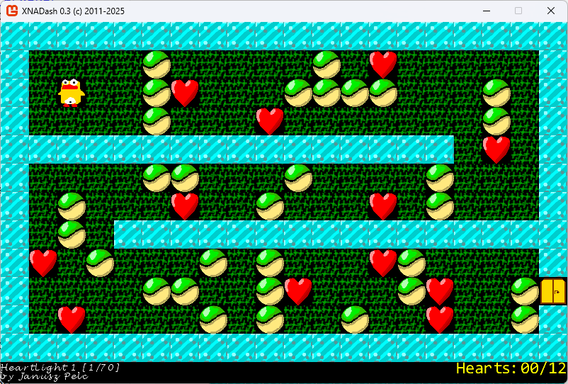

# XNADash

## Overview

Years ago, in 2011, I've strated to port an old DOS game, <a href="https://en.wikipedia.org/wiki/Heartlight_(video_game)">Heartlight</a>, to XNA. 

The original is playable using a DOS emulator, can be an online one. There are also other remakes, far better than mine.
<a href='https://www.google.com/search?q=heartlight+play+online'>Click here to play the original version</a>.

In 2025, the old code is recompiled in .NET8/Monogame and published here on Github.

## Assets

* the code was written in C#, completely from scratch, in 2011. I resumed work in 2025 
* starting from 0.53, most textures are taken from the original by taking screenshots and then cropping 32x32 tiles 
* all songs were written by me back in 2011, using <a href='https://openmpt.org/'>OpenMPT</a> 
  (songs are not composed by me, if by any chance you recognize their original author/title, please let me know)

## Unit tests

Since the `DashBoard` class can be orchestrated without a desktop window,
unit tests are possible. Unit tests try to recreate various scenarios and
make sure the physics behaves just like the original. 
	
## Status

There are 70 levels in total. The `LEVELS.HL` file comes from the original. It's a text file that contain all levels. Creating new levels is easy, just edit the text file.

Most levels should be playable. Known issues are described below.

## Changes

### 0.58

* fixed issue 1

### 0.57

* fixed issues 5 and 6
* added exit door texture

### 0.56

* tunnel textures
* fixed the level 22 unit test
* first unit tests added

### 0.55

* added more textures

### 0.54

* dumped the idea of the `NullBlock`, instead changed the order of vertical processing.
* imported first few board textures from the original game. The goal is to finally
fix timing issues with correct number of frames for each texture block

### 0.53

* added the `NullBlock` that lasts 1 frame, placed on a spot where another block fall from. 
This fixes multiple timing issues, e.g. in Level 10 or Level 12 where a balloon has two blocks on it.

## Known issues 

1. Falling bomb currently is blocked by previous explosion and slides of it. Investigate how other blocks should behave

Occurs: level 5  
Status: fixed  
Added: 2025-04-26  
Modified: 2025-04-26

2. Explosions tiggered around are currently invalid, the north and west explosion should be off by 1 frame as in original

Occurs: multiple levels  
Status: pending  
Added: 2025-04-26  
Modified: none

3. Two blocks that cause balloon falling should stick together. Repeatable on level 12 when you consume the grass and blocks fall down.  Currently the top block incorrectly slides off which is invalid

Occurs: level 12  
Status: pending  
Added: 2025-04-26  
Modified: none

4. Falling bomb should correctly explode a stone on level 25. Currently, the bomb explodes because of the top stone falling on it rather than 
  because it falls on the stone below it

Occurs: level 25  
Status: pending  
Added: 2025-04-26  
Modified: none

5. Heart at the end of a tunnel should block the player from entering the tunnel

Occurs: level 29  
Status: fixed  
Added: 2025-04-26  
Modified: 2025-04-26  

6. A tunnel should withstand a bomb exploding nearby

Occurs: level 29  
Status: fixed  
Added: 2025-04-26  
Modified: 2025-04-26
