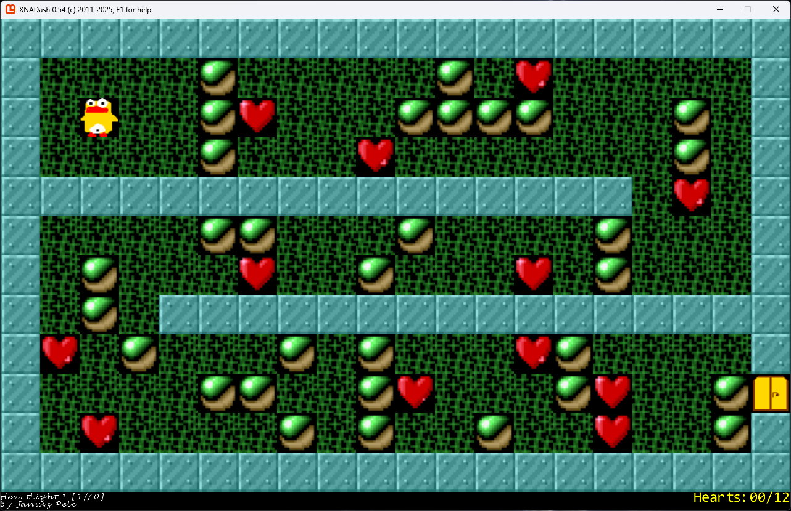

# XNADash

## Overview

Years ago, in 2011, I've ported an old DOS game, <a href="https://en.wikipedia.org/wiki/Heartlight_(video_game)">Heartlight</a>, to XNA. 

The original is playable using a DOS emulator, can be an online one. There are also other remakes, far better than mine.
<a href='https://www.google.com/search?q=heartlight+play+online'>Click here to play the original version</a>.

In 2025, the old code is recompiled in .NET8/Monogame and published here on Github.

## Assets

* the code was written in C#, completely from scratch, in 2011
* all images are hand-drawn by me
* all songs were written by me back in 2011, using <a href='https://openmpt.org/'>OpenMPT</a> 
  (songs are not composed by me, if by any chance you recognize their original author/title, please let me know)
	
## Status

Current version: 0.5

There are 70 levels in total. The `LEVELS.HL` file comes from the original. It's a text file that contain all levels. Creating new levels is easy, just edit the text file.

Most levels should be playable. Known issues are described below.

## Known issues 

### Level 13

Current status: playable.

Fixed in 0.4.

There were two issues here:

* a bomb falling on another falling bomb was still exploding. A pile of falling bombs was exploding in the very same frame.
* a boom lasted too short so that some bombs were falling prematurely

### Level 21

Current status: unplayable

Bomb timing is still invalid. 

### Level 40

Current status: unplayable

Bomb timing is still invalid. 